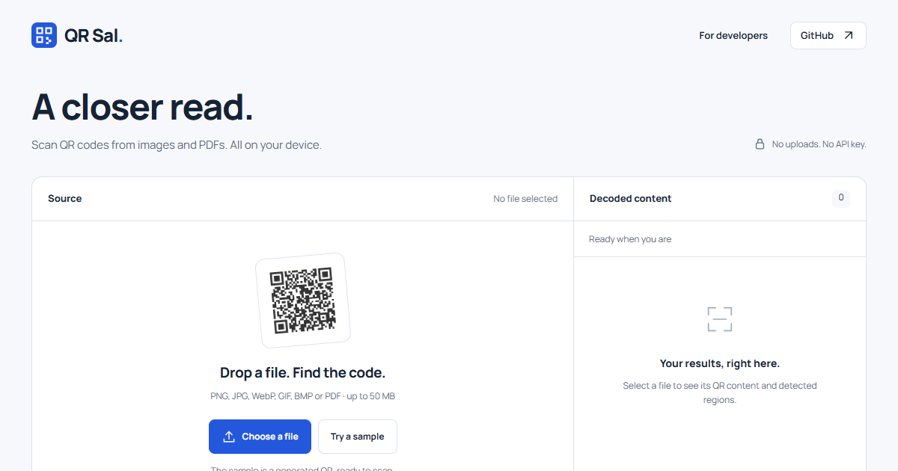

# QR Sal

**A closer read.** An open-source QR code decoder, built in JavaScript by [Sal](https://github.com/SellyAJ).

[Live scanner](https://sellyaj.github.io/qr-sal/) · [API reference](docs/API.md) · [Benchmarks](docs/BENCHMARKS.md) · [How it works](docs/ALGORITHM.md)



QR Sal takes pixels and returns decoded text, QR metadata, and corner coordinates. Its detector, geometric sampler, payload parser, and Reed–Solomon decoder run locally. It does **not** call ZXing, jsQR, WeChat, an AI model, or a cloud service at runtime.

- **One image, multiple codes.** Separate physical symbols remain separate, even when they contain identical text.
- **Recovery for difficult images.** Contrast, polarity, scale, geometry, and sampled-grid recovery passes.
- **Inspect the failure.** Opt-in traces record detection, sampling, format, error-correction, and payload failures.
- **Use it where you work.** ESM, CommonJS, browser global, Web Worker adapter, and TypeScript declarations.
- **A useful demo.** Image and multi-page PDF scanning, region outlines, cancellation, copy, and JSON export. Files stay in the browser.

The decoder core has **zero runtime dependencies**. The demo uses PDF.js to render PDFs; PDF.js does not decode the QR codes.

## Quick start

The package is distributed through this GitHub repository and its releases. It is **not published to the npm registry**.

```sh
npm install github:SellyAJ/qr-sal#v0.1.1
```

Git installs run the `prepare` build and need development dependencies. For an already-built package, download `qr-sal-0.1.1.tgz` from [Releases](https://github.com/SellyAJ/qr-sal/releases) and run `npm install ./qr-sal-0.1.1.tgz`. For reproducibility, pin the release tag or commit rather than the moving branch.

```js
import { scan } from 'qr-sal';

// ImageData from a canvas, or { width, height, data }.
// data: Uint8Array grayscale or Uint8ClampedArray RGBA.
const result = scan(imageData, {
  multiple: true,
  timeLimitMs: 12000,
});

for (const code of result.codes) {
  console.log(code.text, code.corners, code.errorCorrection);
}
if (result.timedOut) console.log('The search may be incomplete.');
```

`scan` is synchronous. Use the worker adapter for responsive browser interfaces:

```js
import { createScanner, imageFromBlob } from 'qr-sal/browser';

const scanner = createScanner();
try {
  const image = await imageFromBlob(fileInput.files[0]);
  const result = await scanner.scan(image, { multiple: true });
  output.textContent = result.codes.map((code) => code.text).join('\n');
} finally {
  scanner.dispose();
}
```

Serve `dist/browser.mjs` and `dist/worker.mjs` together. With a bundler that does not preserve the worker URL, copy `dist/worker.mjs` to a public asset directory and pass `createScanner({ workerUrl: '/assets/qr-sal-worker.mjs' })`. See the [API reference](docs/API.md) for classic scripts, Node, matrix decoding, cancellation, and limitations.

## Try the demo locally

Requires Node.js 22 or newer.

```sh
git clone https://github.com/SellyAJ/qr-sal.git
cd qr-sal
npm ci
npm run dev
```

Open the local URL printed by the server. The `prepare` script builds the library and static site during installation. After edits, run `npm run build`; the development server serves `site/`.

## Measured results, with boundaries

The underlying engine reached **1,135 of 1,148 distinct annotated QR regions** on the 487-image BoofCV corpus (**98.87% region coverage**). Thirteen regions remain undecoded. On 4,593 separately scanned QR crops, every returned payload agreed with the independent comparison reader.

These datasets were used during development and tuning. This is **not an unseen-test accuracy estimate, a guarantee of correct payloads, or a speed comparison on equal compute**. The BoofCV run allowed up to 35 seconds of recovery per image, while the ZXing-C++ comparison used a much faster standard configuration. Read [the full methodology, timing, annotation issues, and scope](docs/BENCHMARKS.md) before quoting these numbers.

Version 0.1.1 preserves every saved result across both collections and reduces decoding time by **5.3% on a preselected 23-image timing sample**, measured three times per input. A separate fresh 70-image evaluation is also recorded. See [the performance report](docs/PERFORMANCE.md) for selection, exact comparisons and remaining failures.

## What it supports

QR Code Model 2, versions 1–40; L/M/Q/H correction levels; numeric, alphanumeric, byte and Kanji payloads; selected ECI encodings; normal and inverted symbols. UTF-8 is attempted for unlabelled byte data, with a Latin-1 fallback.

**Not supported:** 1D barcodes, Micro QR, rMQR, QR Model 1, structured-append assembly, and arbitrary ECI assignments. See [encoding details](docs/API.md#encodings).

Recovery can be slow. A successful decode validates QR structure and error correction; it does not authenticate the issuer or make a decoded link safe. `checksumPassed` is a legacy field name for those checks, not a cryptographic checksum. No calibrated confidence percentage is provided. A time limit or a result on a page does not establish that every symbol was found.

## Development

```sh
npm test
npm run check:types
npm run check:privacy
npm pack
```

The suite includes independent synthetic QR matrices, distortion and blur recovery, negative controls, multiple symbols, Reed–Solomon errors/erasures, time budgets, and public package entry points. Fixture generators use an independent encoder and contain no customer documents. See [CONTRIBUTING.md](CONTRIBUTING.md).

## License and credits

[MIT](LICENSE). QR block-parameter tables are derived from Project Nayuki’s MIT-licensed QR Code generator. Format and mathematical references include DENSO WAVE and ZXing; attribution is retained in [THIRD-PARTY-NOTICES.txt](THIRD-PARTY-NOTICES.txt). The demo’s Manrope font uses the SIL Open Font License. Public benchmark datasets belong to their respective authors and are not redistributed here.
